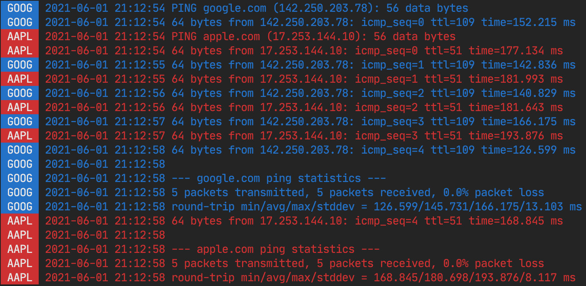

# lineprefix

[](https://pkg.go.dev/github.com/abiosoft/lineprefix)

`io.Writer` wrapper with line prefix and color customizations.

## Usage

### Static Prefix

```go
prefix := lineprefix.Prefix("app |")
writer := lineprefix.New(prefix)

fmt.Fprintln(writer, "hello world")
```

output

```
app | hello world
```

### Dynamic Prefix

```go
now := func() string { return time.Now().UTC().Format("2006-01-02 15:04:05") }
prefix := lineprefix.PrefixFunc(now)
writer := lineprefix.New(prefix)

for i := 0; i<3; i++ {
    fmt.Fprintln(writer, "hello world")
    time.Sleep(time.Second)
}
```

output

```
2021-06-01 18:53:15 hello world
2021-06-01 18:53:16 hello world
2021-06-01 18:53:17 hello world
```

### Color

Coloring is done with [fatih/color](https://github.com/fatih/color).

#### Colored Prefix

A prefix with blue text on white background.

```go
blue := color.New(color.FgBlue, color.BgWhite).SprintFunc()
prefix := lineprefix.Prefix(blue("app"))
writer := lineprefix.New(prefix)

fmt.Fprintln(writer, "this outputs blue on white prefix text")
```

#### Colored Output

A blue colored output.

```go
blue := color.New(color.FgBlue)
option := lineprefix.Color(blue)
writer := lineprefix.New(option)

fmt.Fprintln(writer, "this outputs blue color text")
```

### Example

The example file has an overview of the capabilities.

```
go run example/main.go
```

## Screenshot

colored prefix and colored text from the [example](example/main.go).



## License

MIT
